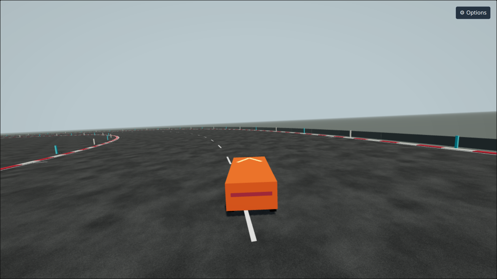
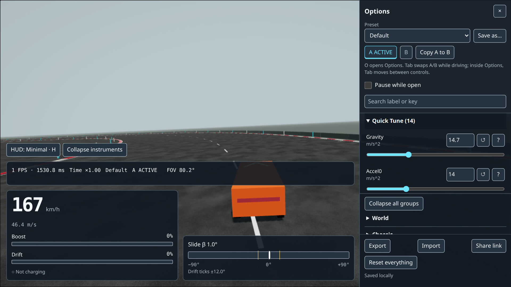
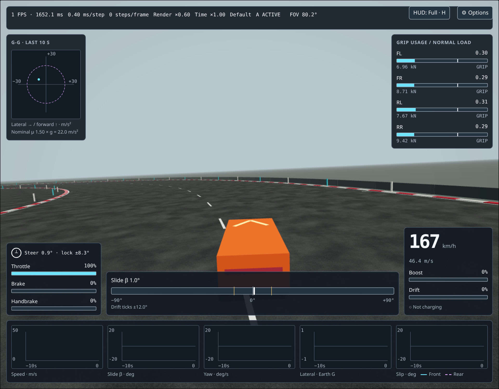

# Slamdemonium Racing
[](https://github.com/huntergdavis/slamdemonium/actions/workflows/ci.yml)
[Play Slamdemonium Racing](https://hunterdavis.com/slamdemonium/)

A fast, loud, crash-happy arcade racer that runs in a browser tab.



## What this is right now

Slamdemonium Racing is not a game yet. The first milestone is a **driving-feel laboratory**:

> A plain box drives around a big paved circle in 3D. Every number that shapes how it accelerates, brakes, grips, slides and drifts is a slider on an options page that applies live. Overlays show what the physics is doing. A human can sit in it for an hour and find the fun.

Why start here? Browser racers usually fail on one thing: the driving does not feel right. Too floaty, too sim-heavy, or too sticky, and the speed never lands. If the box feels fast and fun on flat pavement, everything else (car models, crashes, traffic, opponents) is content on a foundation that works. If it does not, no content will save it.

The lab is built around six design pillars:

1. **Speed is felt, not read.** Punchy acceleration, a world that streams past, a camera and field of view that react to speed.
2. **Drifting is easy to start and rewarding to hold.** Grip hard, let go progressively, catch it, charge the boost meter.
3. **Braking is powerful and predictable.** Late braking is a tactic. Brake response is a real curve, not one number.
4. **Assists are dials, not walls.** Every arcade assist is a slider that goes to zero.
5. **Tunability beats correctness.** Any physical shortcut is fine if it feels better and has a slider.
6. **Latency is a feature.** Input-to-motion delay is measured and minimized.



Every slider applies while you drive. Press **O**, drag, feel the difference, drag it back. The full HUD shows what the physics is doing underneath: a G-G diagram, grip usage on each wheel, slide angle, and ten seconds of graphs.



When you are tuning and something feels wrong, start with [docs/TUNING_PLAYBOOK.md](docs/TUNING_PLAYBOOK.md). The full design brief is [docs/vertical-slice-design.md](docs/vertical-slice-design.md).

## Run it

**Play it in your browser:** <https://hunterdavis.com/slamdemonium/>

Open the link in Chrome, Firefox or Safari on a desktop, click the page, press **W** and go. Nothing to install, no account.

### Run it from source

For contributors, or if you want to change the code. You need [Node.js](https://nodejs.org) 22 or newer. Then, from the project folder:

```sh
npm install
npm run dev
```

Open <http://127.0.0.1:5173/> in your browser. Changes to the code reload in place while the dev server runs.

To build a standalone copy for any static web host:

```sh
npm run build
```

The result lands in `dist/`. Nothing on the server side is required.

## Controls

Keyboard and controller both work, at the same time, with nothing to switch. A controller is the better experience: its triggers are analog, so you can feed in half throttle or trail the brake, which the keyboard cannot do. Keyboard steering and pedals are smoothed so digital keys still feel like pedals.

### Keyboard

| Action | Keys |
|---|---|
| Throttle | W, Up |
| Brake / reverse | S, Down |
| Steer | A / D, Left / Right |
| Handbrake | Space |
| Boost | Left Shift |
| Respawn | R |
| Options panel | O |
| HUD mode (full / minimal / off) | H |
| Debug gizmos | G |
| Camera preset (chase / far / hood) | C |
| Slow motion toggle (0.25x) | T |
| Pause | P |
| Latency probe | L |
| A/B tuning swap | Tab |
| Telemetry recording (CSV) | F9 |

### Controller

> **Plugged in and nothing happens?** Browsers do not hand a controller to a page until you press a button on it. Click the game once, then press any face button on the pad. After that it just works. If the pad still does nothing, it is probably not reporting the standard layout; most Xbox and PlayStation style pads do.

| Action | Control |
|---|---|
| Throttle | Right trigger (analog) |
| Brake / reverse | Left trigger (analog) |
| Steer | Left stick, left and right |
| Handbrake | A (bottom face button) |
| Boost | X (left face button) |
| Respawn | Y (top face button) |
| Options panel | Start |

Everything not in this table (HUD, camera, slow motion, pause, A/B swap, recording) stays on the keyboard. If you press a driving key on the keyboard while holding the pad, the keyboard wins for as long as the key is down, then the pad takes over again.
