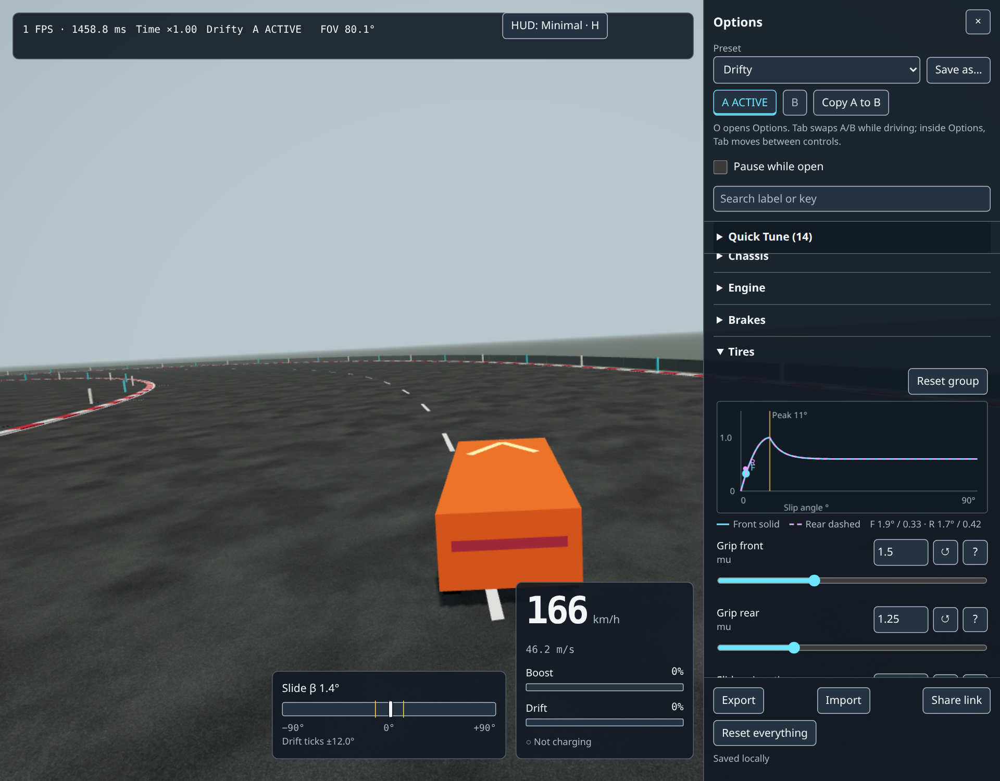
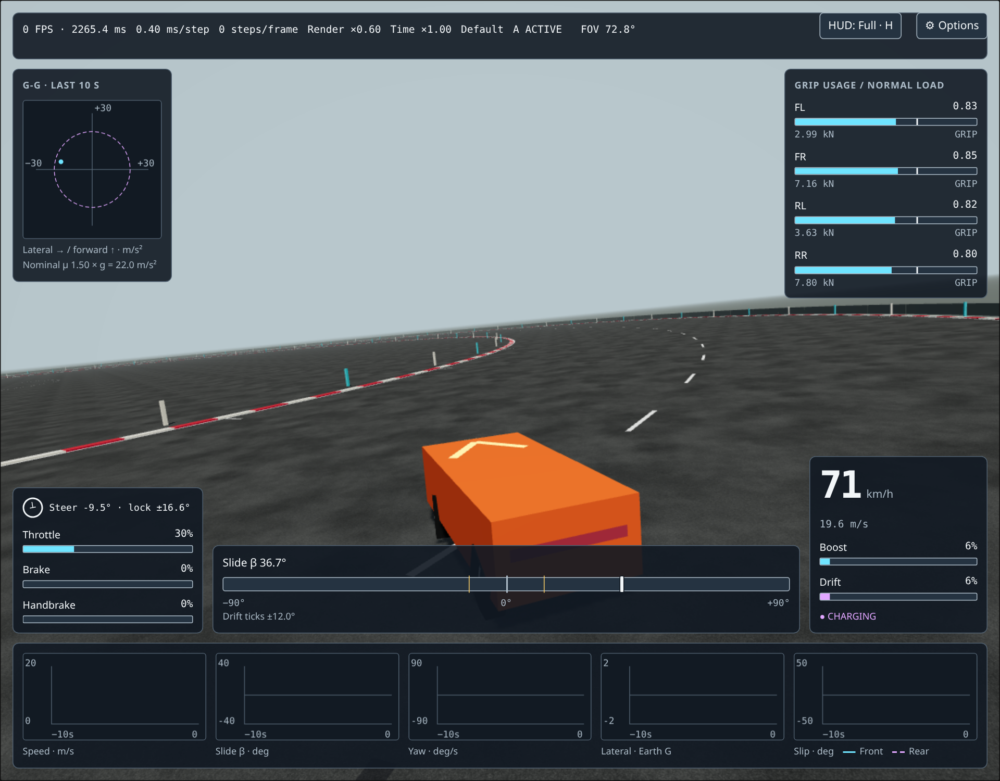

# Tuning Playbook

How to make the car feel right, and what to turn when it does not.

For a repeatable first session, follow the [30-minute tuning method](research/tuning-method.md): a fixed route, one-slider A/B comparisons, blind re-tests, and G-G/CSV checks.

This is the human-facing copy of section 7.4 of the [design doc](vertical-slice-design.md). The same table ships inside the game as a collapsible help panel in the Options page. If you change one, change the other. Two behaviors have moved on from the design doc since it was written, and this page follows the shipped behavior: how drift angle control works ([drift assist note](research/drift-assist.md)) and the cap on camera field of view ([speed and vibe note](research/speed-and-vibe.md)). Terms are defined in the [Glossary](GLOSSARY.md).

## How tuning works

Every number that shapes the driving is a parameter with a slider. There are 69 of them, defined once in `src/tuning/schema.ts` and grouped as World, Chassis, Engine, Brakes, Tires, Steering, Suspension, Boost & Drift, Collision and Camera. The full table with defaults, ranges and one-line explanations is in [section 7.2 of the design doc](vertical-slice-design.md#72-the-parameters).

Two rules to keep in mind while you tune:

- **Every default is a starting guess.** Nothing in the table is a truth. Trust your hands, not the number.
- **Everything applies live.** Drag a slider and the physics reads the new value at the start of the next step. No reload. The handful of mass-related parameters (mass, centre of mass offsets, inertia scales) rebuild the body within 200 ms without moving the car.

### Open the Options page

Press **O** or click the gear button. The panel slides in from the right and the game keeps running behind it. Tick "Pause while open" if you want to freeze the car while you think. After you touch a slider, the driving keys keep working.

### Start with Quick Tune

The pinned **Quick Tune** section at the top holds the 14 sliders that change the feel the most:

| Slider                | What it changes                                                                |
| --------------------- | ------------------------------------------------------------------------------ |
| `gravity`             | Weight of everything. Higher feels heavier and grippier.                       |
| `accel0`              | Full-throttle acceleration from a standstill.                                  |
| `topSpeed`            | Speed where unboosted acceleration reaches zero.                               |
| `brakeDecel`          | Peak braking deceleration.                                                     |
| `handbrakeRearGrip`   | Rear grip while the handbrake is held. Lower slides more.                      |
| `gripFront`           | Front tire peak friction.                                                      |
| `gripRear`            | Rear tire peak friction. Lower than front gives oversteer.                     |
| `slideGripRatio`      | Grip left once sliding, as a fraction of peak. Low is loose; near 1 is sticky. |
| `slipFalloffRate`     | How abruptly grip drops after the peak. High is a cliff; low is progressive.   |
| `downforceAtTopSpeed` | Extra downward force at top speed, as a multiple of weight.                    |
| `steerMaxTopSpeed`    | Maximum steering angle at top speed. Lower is calmer.                          |
| `countersteerAssist`  | Automatic steering toward the direction of travel in a slide.                  |
| `yawAssist`           | Yaw-rate help while gripping, and drift-angle control while sliding.           |
| `fovSpeedGain`        | Extra field of view at top speed.                                              |

Below Quick Tune, one collapsible section per group holds everything else. The search box filters by label or key.

### Read the tire curve

At the top of the Tires group a small plot draws the grip curve for the front and rear tires, with a moving dot for where each axle is operating right now (slip angle across, grip usage up). Watch it while you drag `slipFalloffRate`, `slideGripRatio` and `peakSlipAngle`. It is the fastest way to understand what those three do.

### Compare with A/B slots

Two parameter slots, A and B, hold complete sets of values. Press **Tab** while the game has focus to swap them instantly; the HUD shows which one is live. Inside the Options page, Tab moves between controls as usual, so the panel has its own A and B buttons. The workflow that works:

1. Click **Copy A to B**.
2. Change one thing in B.
3. Drive a lap. Press **Tab** on the straight. Drive another lap.
4. Keep whichever felt better.

### Presets

The preset dropdown ships four starting points. Each is a partial set of overrides on the defaults.

| Preset      | Character                                   | Overrides                                                                                                                                                                  |
| ----------- | ------------------------------------------- | -------------------------------------------------------------------------------------------------------------------------------------------------------------------------- |
| **Default** | The starting guess.                         | none                                                                                                                                                                       |
| **Grip**    | Sticky, stable, forgiving.                  | `gripFront` 1.9, `gripRear` 1.9, `slideGripRatio` 0.92, `slipFalloffRate` 0.7, `handbrakeRearGrip` 0.5, `yawAssist` 0.2, `countersteerAssist` 0.3                          |
| **Drifty**  | Tail-happy, long holdable slides.           | `gripRear` 1.25, `slideGripRatio` 0.60, `slipFalloffRate` 2.5, `handbrakeRearGrip` 0.20, `driveBias` 0.8, `yawAssist` 0.6, `countersteerAssist` 0.8, `driftChargeRate` 0.6 |
| **Raw**     | Every assist off. Feel the bare tire model. | `yawAssist` 0, `countersteerAssist` 0, `tireRelaxationLength` 0.9, `downforceAtTopSpeed` 0.2, `steerExpo` 0, `absStrength` 0, `camVelocityBlend` 0                         |

Try Raw first. Then add assists back one at a time and stop when it is fun.

**Save as...** stores your own named preset in the browser. **Export** downloads the full set as JSON, including a change log of every slider move with timestamps, so you can reconstruct which change made it better. **Import** loads one back. **Share link** puts your changed values in the URL so someone else can open exactly your setup. Your working set auto-saves and comes back on reload; **Reset everything** clears it.

## Symptom to slider

Find the row that matches what you feel. Try the knobs in the order listed; each is one slider move.

| Symptom                                             | First knobs to try                                                                                                                                                                                                                                                                                                                                                                             |
| --------------------------------------------------- | ---------------------------------------------------------------------------------------------------------------------------------------------------------------------------------------------------------------------------------------------------------------------------------------------------------------------------------------------------------------------------------------------- |
| Feels slow even at top speed                        | Raise `fovSpeedGain`, raise `accel0`, lower `camDistance`, raise `powerCurveExp` so acceleration lasts. Check the speed cues (roadside posts, centre line, fog, camera shake; design section 10.2) before touching physics. Delivered FOV is capped at 115 degrees vertical; once the debug text says the cap is active, FOV sliders do nothing more, so try `camDistance` on its own instead. |
| Feels floaty or weightless                          | Raise `gravity`, raise `suspFrequency`, raise `downforceAtTopSpeed`, lower `comHeightOffset`.                                                                                                                                                                                                                                                                                                  |
| Twitchy or nervous at high speed                    | Lower `steerMaxTopSpeed`, raise `tireRelaxationLength`, raise `yawInertiaScale`, raise `steerExpo` on gamepad.                                                                                                                                                                                                                                                                                 |
| Understeers, will not turn in                       | Raise `gripFront`, lower `slipFalloffRate`, move `comLongOffset` forward, raise `steerMaxTopSpeed`, raise `yawAssist`.                                                                                                                                                                                                                                                                         |
| Snaps into a spin                                   | Lower `slipFalloffRate`, raise `slideGripRatio`, raise `countersteerAssist`, lower `maxDriftAngle`.                                                                                                                                                                                                                                                                                            |
| Cannot start a drift                                | Lower `handbrakeRearGrip`, lower `gripRear`, raise `driveBias`, raise `steerMaxLowSpeed`.                                                                                                                                                                                                                                                                                                      |
| Drift will not hold                                 | Raise `yawAssist`, raise `slideGripRatio`, raise `maxDriftAngle`, check `driftMinAngle`.                                                                                                                                                                                                                                                                                                       |
| Drift never ends / feels on rails                   | Lower `yawAssist`, lower `countersteerAssist`, lower `slideGripRatio`.                                                                                                                                                                                                                                                                                                                         |
| Brakes feel grabby or weak                          | Adjust `brakeCurveExp` first (pedal shape), then `brakeDecel`; if wheels lock, raise `absStrength` or lower `brakeBiasFront`.                                                                                                                                                                                                                                                                  |
| Body rocks like a boat                              | Raise `suspDampingRatio`, raise `suspAntiRoll`, raise `tireForceHeight`, lower `comHeightOffset`.                                                                                                                                                                                                                                                                                              |
| Lands nose-first or on the roof after a jump        | Raise `airAutoLevel`. If you were holding an input in the air, lower `airControlAuthority` so a held stick cannot over-rotate you.                                                                                                                                                                                                                                                             |
| Cannot correct a bad launch in the air              | Raise `airControlAuthority`; lower `airAutoLevel` a little so the car stops fighting your input.                                                                                                                                                                                                                                                                                               |
| Tumbles or wobbles after leaving a ramp             | Raise `airDamping`.                                                                                                                                                                                                                                                                                                                                                                            |
| Jumps feel dead, the car just flies straight        | Lower `airDamping`, raise `airControlAuthority`, lower `airAutoLevel`.                                                                                                                                                                                                                                                                                                                         |
| Nose keeps rising when you hold throttle in the air | Holding the throttle you took off with is neutral; the nose only rises if you press more than that. Ease back to the takeoff level, or lower `airControlAuthority`.                                                                                                                                                                                                                            |

### How drift control behaves

The drift rows above assume the shipped drift angle control, which differs from the formula printed in design 6.8 C. What to expect:

- A drift starts once you are sliding about 10 degrees with intent: handbrake, or throttle plus steering. The game latches which side you are sliding and remembers the angle you entered with.
- Stick centered holds that entry angle. Steering into the slide asks for more, up to `maxDriftAngle`. Full counter-steer asks for zero, which is how you exit cleanly. Lifting the throttle with the handbrake released also asks the car to straighten.
- The drift ends once you are under about 6 degrees for a tenth of a second. Outside a drift the control does nothing.
- Past `maxDriftAngle` a limiter blends in to stop an accidental spin. It scales with `yawAssist`, so it is a soft nudge, not a wall, and at `yawAssist` zero it is off along with everything else.

So if a drift will not end, counter-steer fully or lift before reaching for sliders. If a drift will not hold with the stick centered, raise `yawAssist` first. If you want fewer surprises, keep `maxDriftAngle` near the angles you actually drive at. Details and the acceptance test are in the [drift assist note](research/drift-assist.md).

### In the air

Once all four wheels have been off the ground for a tenth of a second you get pitch and roll, nothing else: no yaw, and the handbrake does nothing. A kerb hop is too short to count, so it never gives you control you did not ask for.

- Pressing more throttle than you held at takeoff lifts the nose; easing off or braking dips it. Holding exactly what you took off with is neutral, so flat-out through a jump does not pitch you up. Steering banks the car the way you steer.
- `airControlAuthority` is how fast you can rotate at full input, in turns per second. The default is a quarter turn per second: enough to fix a bad launch during a one-second jump, not enough to flip. At zero you have no say in the air and only self-levelling and gravity act. At one you can flip once in a second-long jump and it is easy to over-rotate into the landing.
- `airAutoLevel` steers the car back toward wheels-down whenever you are not asking for something. Your input overrides it in proportion, so a full stick ignores it entirely. At the default of 0.5 most jumps land on the wheels without help. At zero it is the skilful option with no safety net: whatever attitude you leave the ramp with is what you land with unless you fix it yourself. At two it snaps level almost immediately and landings stop being something you can get wrong.
- `airDamping` is how quickly a spin dies off whenever fewer than two wheels are on the ground. It also resists your own inputs, so if control feels muddy, lower it slightly before raising authority. High values make big tumbles settle fast but can feel like flying through syrup.

A hard landing kicks the camera and the controller by how fast you came down, on the same scale as a wall hit; that is not a slider. The ramps themselves are authored geometry, not tuning.

The default world is the proving ground: you spawn at the south end of a 700 m runway facing north, and on the target line 380 m ahead are the giant ramp (centre lane), the small 10 m loop (left branch) and the big 18 m loop (right branch). Respawn (R) puts you back on the same line, so a run is: hold throttle, pick a lane, hit the target, press R. The 50 m crossbars count your approach. Add `?map=lab` to the URL for the old 150 m ring.

The two loops are the loop experiment. The small one on the left is the original 10 m loop, untouched: it needs a dead-on entry between 36 and 44 m/s and any correction inside it spins the car, because its wheels carry 18 to 26 times their static weight and the tyres are already at their limit on a perfect line. The big one on the right is 18 m, with a 20 m lane, gentle banked shoulders and its own tinted surface. It takes a crooked entry (30 degrees, 10 m off centre in the test), completes from 16 m/s up, and survives most of a full-lock jab on the wall. `loopGrip` scales tyre friction on the tinted surface only, 1 = plain asphalt. Measured, neither 0.8 nor 1.5 widened the window; it is there so you can feel that for yourself.

## Sanity references

With the defaults, these are the numbers the car should roughly hit. If a tune drifts far from them, that is fine, but know that you did it. Full table in [Appendix A of the design doc](vertical-slice-design.md#appendix-a-what-the-default-numbers-mean).

| Quantity                         | Default value              |
| -------------------------------- | -------------------------- |
| 0 to 100 km/h                    | about 2.15 s               |
| 0 to 198 km/h (55 m/s)           | about 6.7 s                |
| Full brake from 100 km/h         | about 1.3 s, about 18 m    |
| Peak cornering at low speed      | about 2.25 x Earth gravity |
| Steering lock at 0 / 30 / 60 m/s | 32 / 12.9 / 5 degrees      |

## Useful keys while tuning

| Key | Does                                                                                |
| --- | ----------------------------------------------------------------------------------- |
| O   | Options page                                                                        |
| T   | Slow motion (0.25x), to watch a drift catch frame by frame                          |
| Tab | Swap A/B slots (game focused; use the panel's A/B buttons when the panel has focus) |
| H   | Cycle HUD: full / minimal / off                                                     |
| G   | Debug gizmos (forces, contact points)                                               |
| F9  | Start/stop a telemetry CSV recording                                                |
| R   | Respawn                                                                             |

Slow motion changes how many physics steps run per second, never the step length, so what you see at 0.25x is exactly what happens at full speed.
