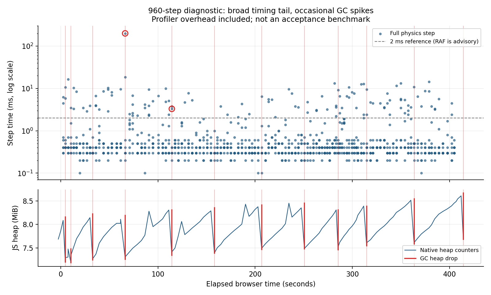

# RAF outliers: mostly outside GC, with real allocation churn

**Keep the manual full-step gate. Investigate allocation churn separately.**
A 960-step diagnostic found 119 RAF physics steps above 2 ms. Two decisively
overlap GC; one more has a 0.012 ms boundary overlap inside the clock's roughly
0.1 ms resolution. The other 116 do not overlap GC. This supports a substantial
non-GC timing problem; it does **not** prove that every remaining delay is OS
scheduling. Stable retained heaps do not establish an allocation-free hot path.

## Evidence, 2026-09-20

| Observation                             | Result                                                                 |
| --------------------------------------- | ---------------------------------------------------------------------- |
| Outliers in successive 120-step windows | 20, 23, 6, 8, 9, 15, 20, 18                                            |
| Adjacent slow-step pairs                | 11; outliers occupy every position in the eight-step frame batches     |
| Main-thread collections                 | 10 minor, 2 major; most heap drops are about 0.9–1.0 MB                |
| Worst physics step                      | Step 150: 199.9 ms, including a 198.801 ms major GC interval           |
| CPU inside that major GC                | 15.035 ms thread time; wall duration includes substantial off-CPU time |
| Other decisive overlap                  | Step 241: 3.3 ms, including a 2.611 ms minor GC                        |

The original **unprofiled** sustained run had manual full-step p99 **0.5 ms**,
RAF full-step p99 **9.5 ms**, and RAF Jolt-only p99 **0.3 ms**. Retained JS grew
**2.85%** and WASM allocator use stayed flat. In the separate diagnostic, RAF
p99 was **10.8 ms**; its pre-trace manual sample was **5.2 ms**, with added step
timestamps and different host conditions. Even manual CPU timing is not
invariant. These numbers do not establish target-device frame performance.

## Allocation sites to inspect

Sampled bytes estimate allocation traffic, including subsequently collected
objects. They are neither live retained bytes nor exact object counts.

| Sampled path                                          | Estimated allocation traffic                             |
| ----------------------------------------------------- | -------------------------------------------------------- |
| Three.js getParameters                                | 2,759,488 bytes; top three stacks account for 2,726,688  |
| Three.js getProgramCacheKey                           | 1,056,624 bytes, including array push/join paths         |
| Vehicle.preStep → tires                               | 1,016,196 bytes; 606,432 directly attributed to tires    |
| Vehicle.preStep → suspension → adapter.rayCast        | 475,308 bytes                                            |
| Vehicle.preStep → suspension, excluding rayCast above | 295,060 bytes; 278,668 directly attributed to suspension |

[Selected full stacks and profile node IDs](perf-allocation-stacks.json) contain
31 disjoint sampled self-allocation nodes. The table sums them by call stack,
including children assigned to each group; rayCast is not counted twice under
suspension. Earlier quick findings reported the largest direct-self stacks.

The renderer's mapped function builds a fresh parameter object at
[Three r186 WebGLPrograms.js:189](https://github.com/mrdoob/three.js/blob/r186/src/renderers/webgl/WebGLPrograms.js#L189).
The call chain runs through
[WebGLRenderer.getProgram / setProgram](https://github.com/mrdoob/three.js/blob/r186/src/renderers/WebGLRenderer.js#L2187)
and renderBufferDirect, including shadow passes. Additional sampled paths
include [getProgramCacheKey array construction and joining](https://github.com/mrdoob/three.js/blob/r186/src/renderers/webgl/WebGLPrograms.js#L402),
camera/normal-matrix updates and matrix arithmetic. Distinguish dependency churn
from application allocations such as future skid-mark objects.

Vehicle and raycast entries are **function-level attribution**, not a mapped
allocating statement. Do not infer a native allocation or ownership bug from
them. Keep [R1's borrowed-return rules](jolt-integration.md) intact while
investigating. Developer 1 and the PM received these findings before this note.

## Method and limits

Same WP5 vehicle/track and procedural inputs, two manual warm-up replays, exact
960-step EOF. A preallocated array stored step-start timestamps. Chromium GC
events and native heap counters were aligned with one User Timing mark; 16 KiB
heap sampling retained both minor- and major-collected objects. No lost trace
data or step samples. The join allows 0.1 ms clock uncertainty, so the third
boundary match is not causal evidence. Profiling changes timing and allocation
traffic; automation serialization also appears in the profile and is excluded
from the application table above.

[Compact chart data and trace/asset hashes](perf-outliers-data.json) preserve the
measurements. The 73 MB raw trace, allocation profile and chronological samples
remain in the research checkout's ignored test-results/perf-gc directory.
Next: source-level allocation attribution on a quiet host, with renderer and
vehicle paths measured separately, while retaining the 2 ms budget.

## Baseline and reproduction

Production assets were built at local pre-rebase commit
**70640d123ea750d3d1c3d39305e674515f49b0c7**. The public reproduction baseline is
**03b79e4063698e1171ce608232fd3f5bb7b9f64e** (PR #41): its source differs only in
the unimported speedCues fractional-DPR fix. Boot, vehicle, input mapper, physics
adapter and renderer sources match. The chart data records SHA-256 hashes of
the actual app/Jolt assets and raw trace. The clean sustained run cited above
preceded this capture, at local commit f8ec104a6bb07d6a4210f93bcde0b7c57e976ea1.

1. Build the selected revision with npm ci and npm run build. Install Chromium
   with npx playwright install chromium if needed. Keep browser, viewport,
   presets and input sequence consistent between comparisons.
2. Run npx tsx scripts/perf/diagnose-gc.ts test-results/perf-gc-after. The helper
   runs two manual warm-ups, one manual measurement and one exact 960-step RAF
   replay. Allow about ten minutes on this shared software renderer, including
   export. For the older baseline, invoke the helper by its absolute path from
   the evidence checkout while the working directory is the baseline checkout;
   it serves that working directory's built assets.
3. Compare allocation.json sampled self sizes and stacks, counting collected
   objects. Load trace.json in Chromium's Performance panel to inspect GC;
   samples.json preserves step timestamps, durations and the clock anchor.
   Do not compare minified function names alone across builds.

The original 77 KB sampling profile remains available at
/home/hunter/workspace/slamdemonium-for-research/test-results/perf-gc/allocation.json.
The committed extract removes unrelated automation stacks; the raw trace stays
out of Git. WP13 should reduce allocation traffic and collection pressure.
**A frame-time or p99 improvement is not promised by this evidence.**
